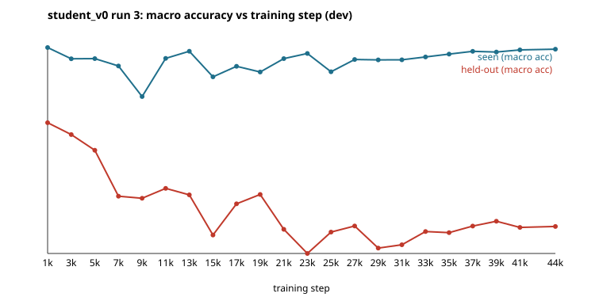
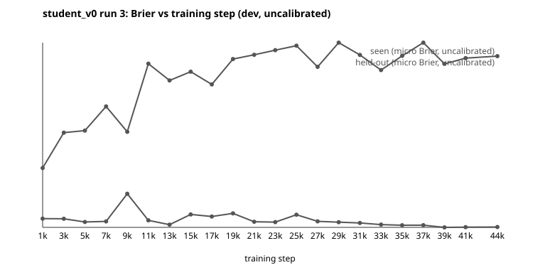

# student_v1 — V3: checkpoint trajectory (seen vs held-out)

Generated by `scripts/student/v3_trajectory.py` and `scripts/student/v3_metrics.py` from `outputs/student_v1/V3/`. Do not edit by hand.

Analysis only: nothing here selects a checkpoint, a configuration or a temperature. Scoring is bf16 with no padding (batch size 1, the V2 evaluation path). 22 checkpoints of student_v0 run 3, from step 1,000 to 44,000: every 4th of the 88 checkpoints from step 1,000, plus the last.

Seen items: 2,019 (the student_v0 selection sample). Held-out items: 2,574 (dev items of the four held-out templates, D14).

## Result

- Held-out skill falls with training. Spearman(step, held-out per-template macro accuracy) = -0.637, 95% bootstrap CI [-0.862, -0.223] (points resampled, 2,000 resamples). The interval excludes zero.
- Seen-template skill does not show a clear trend: Spearman = +0.334, CI [-0.175, +0.764].
- The same fall appears under the selection metric (pooled per-class macro, see definitions): held-out 0.3899 at step 1,000 -> 0.1577 at step 44,000.

## Definitions

- **per-template macro**: mean over templates of per-template accuracy (the G1 definition).
- **pooled-class macro**: the trainer's `macro_accuracy` (mean per-class recall over canonical letters pooled across templates); the selection metric of student_v0 and of arms A-C. Reconstructed offline from the saved predictions; at step 1,000 the seen value (0.6793) matches student_v0's recorded selection value (0.6798, batched path) to 0.0005.
- **Brier** is uncalibrated (checkpoints carry no fitted temperature).

## Table

| step | seen per-template macro | seen pooled macro | seen micro acc | seen Brier | held-out per-template macro | held-out pooled macro | held-out micro acc | held-out Brier |
|---:|---:|---:|---:|---:|---:|---:|---:|---:|
| 1,000 | 0.7080 | 0.6793 | 0.7415 | 0.3501 | 0.5498 | 0.3899 | 0.5894 | 0.5408 |
| 3,000 | 0.6843 | 0.6260 | 0.7266 | 0.3495 | 0.5248 | 0.3318 | 0.5412 | 0.6735 |
| 5,000 | 0.6848 | 0.6547 | 0.7236 | 0.3376 | 0.4918 | 0.2364 | 0.5256 | 0.6812 |
| 7,000 | 0.6693 | 0.6711 | 0.7162 | 0.3396 | 0.3952 | 0.2411 | 0.4441 | 0.7724 |
| 9,000 | 0.6049 | 0.4286 | 0.6632 | 0.4436 | 0.3909 | 0.3182 | 0.4305 | 0.6767 |
| 11,000 | 0.6852 | 0.6074 | 0.7320 | 0.3435 | 0.4117 | 0.2912 | 0.4277 | 0.9332 |
| 13,000 | 0.7002 | 0.6006 | 0.7424 | 0.3274 | 0.3979 | 0.2056 | 0.4413 | 0.8700 |
| 15,000 | 0.6463 | 0.5685 | 0.6969 | 0.3659 | 0.3136 | 0.1630 | 0.3563 | 0.9030 |
| 17,000 | 0.6686 | 0.5783 | 0.7078 | 0.3582 | 0.3793 | 0.2399 | 0.4413 | 0.8551 |
| 19,000 | 0.6566 | 0.5656 | 0.7107 | 0.3699 | 0.3989 | 0.1892 | 0.4367 | 0.9507 |
| 21,000 | 0.6847 | 0.6488 | 0.7355 | 0.3383 | 0.3255 | 0.1576 | 0.3636 | 0.9667 |
| 23,000 | 0.6955 | 0.6106 | 0.7375 | 0.3370 | 0.2747 | 0.1439 | 0.3322 | 0.9840 |
| 25,000 | 0.6570 | 0.6043 | 0.7172 | 0.3649 | 0.3196 | 0.1529 | 0.3528 | 1.0010 |
| 27,000 | 0.6829 | 0.5164 | 0.7335 | 0.3400 | 0.3326 | 0.1741 | 0.4017 | 0.9213 |
| 29,000 | 0.6821 | 0.5719 | 0.7340 | 0.3366 | 0.2860 | 0.1480 | 0.3415 | 1.0123 |
| 31,000 | 0.6821 | 0.6000 | 0.7330 | 0.3338 | 0.2931 | 0.1475 | 0.3403 | 0.9662 |
| 33,000 | 0.6882 | 0.6124 | 0.7390 | 0.3276 | 0.3209 | 0.1628 | 0.3757 | 0.9093 |
| 35,000 | 0.6942 | 0.6509 | 0.7410 | 0.3253 | 0.3185 | 0.1571 | 0.3625 | 0.9625 |
| 37,000 | 0.7001 | 0.6585 | 0.7469 | 0.3255 | 0.3323 | 0.1569 | 0.3621 | 1.0124 |
| 39,000 | 0.6986 | 0.6511 | 0.7469 | 0.3172 | 0.3425 | 0.1618 | 0.3733 | 0.9325 |
| 41,000 | 0.7030 | 0.6623 | 0.7449 | 0.3181 | 0.3296 | 0.1567 | 0.3617 | 0.9542 |
| 44,000 | 0.7046 | 0.6672 | 0.7489 | 0.3185 | 0.3315 | 0.1577 | 0.3640 | 0.9616 |

## Figures

## Reading against the ADVISORY (§2)

The ADVISORY names the outcome "held-out accuracy falling with training -> template over-fitting; the next loop uses early stopping on a held-out-like dev signal and more templates per step". The measurement above is that outcome for student_v0's training mix. It is a measurement, not a cause: the mix had 14 templates and no PubMed data. Whether the V4 mix (arms A-C) follows the same curve is tested in V6-V8, not here.

